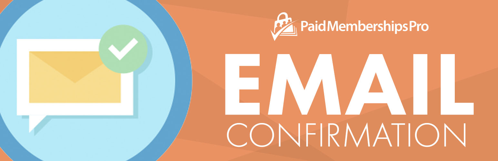

# [Paid Memberships Pro - Email Confirmation](https://www.paidmembershipspro.com/add-ons/email-confirmation-add-on/) #

### Welcome to the Paid Memberships Pro - Email Confirmation GitHub Repository
This Add on for Paid Memberships Pro adds a validation link to the membership confirmation email sent to members when signing up for selected levels on your site.

The membership will be active for the user, but access to members-only content will fail until their email address is validated (the pmpro_has_membership_access_filter will return false).

The site admin can also manually validate any user through the dashboard by clicking the “Validate User” button on the Memberships > Members List or Users admin page.

For more information please visit [https://www.paidmembershipspro.com/add-ons/email-confirmation-add-on/](https://www.paidmembershipspro.com/add-ons/email-confirmation-add-on/)

## Installation ##
For detailed installation steps, visit the our [documentation](https://www.paidmembershipspro.com/add-ons/email-confirmation-add-on/) page.

1. Download the current development ZIP file directly: `https://github.com/strangerstudios/pmpro-email-confirmation/archive/dev.zip`

**Please ensure that once installing this version of the plugin to remove `-dev` from the plugin's folder name.**

## Bugs ##
If you find an issue/bug, let us know by [creating a detailed GitHub issue](https://github.com/strangerstudios/pmpro-email-confirmation/issues/new).

## Support ##
This is a developer's portal for Paid Memberships Pro - Email Confirmation. We do not offer support on this channel. **Any support related questions should be directed to [https://www.paidmembershipspro.com/add-ons/email-confirmation-add-on/](https://www.paidmembershipspro.com/add-ons/email-confirmation-add-on/).**

## Contributing to Paid Memberships Pro - Email Confirmation ##
We encourage and welcome any contribution to Email Confirmation. Please read the [guidelines for contributing](https://github.com/strangerstudios/pmpro-email-confirmation/blob/dev/.github/CONTRIBUTING.md) to this repository.

There are various **ways to help development** of Paid Memberships Pro - Email Confirmation:

1. Report [bugs/issues](https://github.com/strangerstudios/pmpro-email-confirmation/issues/new) on GitHub.
2. Work on any issues by submitting a Pull Request.

Here are some ways for **non-developers to contribute** to Email Confirmation:

1. Translate Email Confirmation into your own [language](https://www.paidmembershipspro.com/paid-memberships-pro-in-your-language/).
2. [Purchase a plus membership](https://paidmembershipspro.com/pricing) to help fund ongoing development and bug fixes.